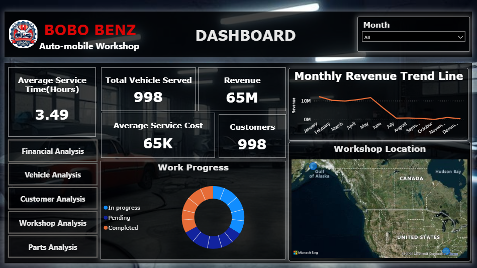
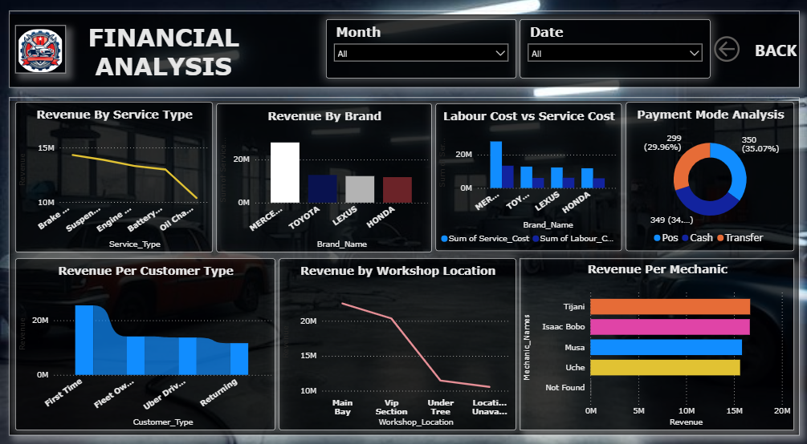
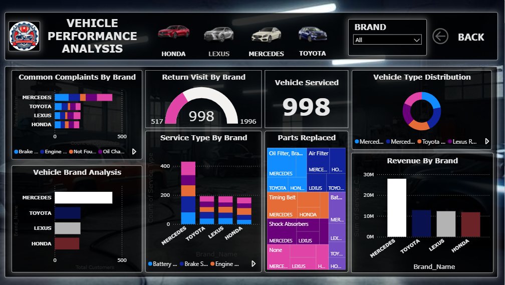
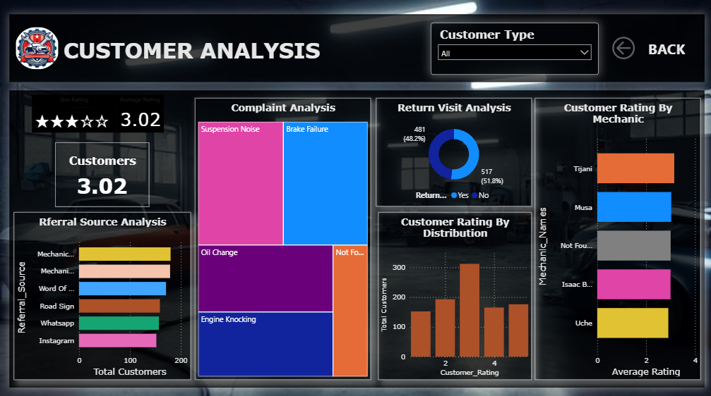
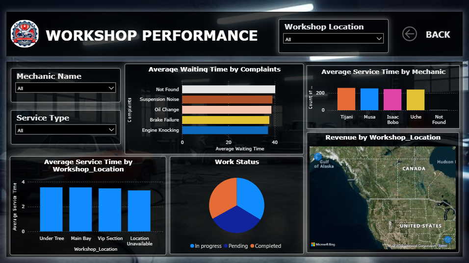
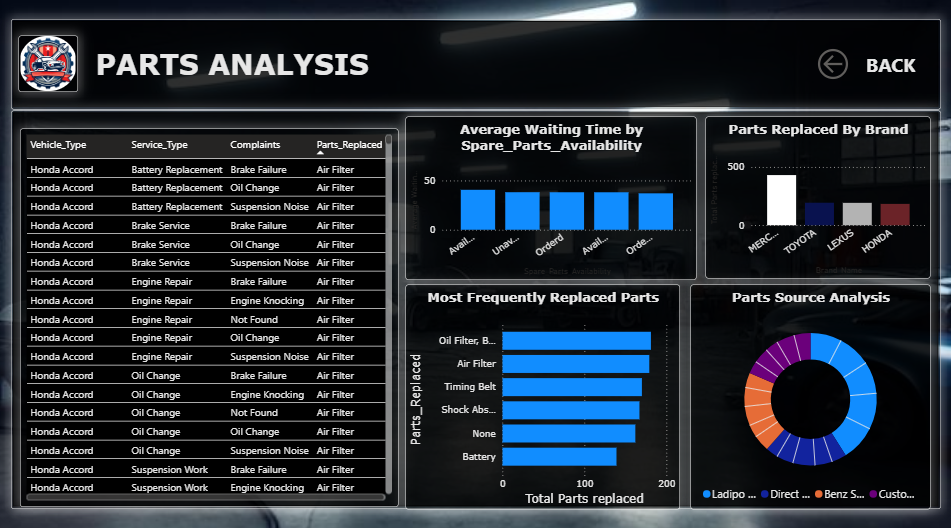

# 🚗 Bobo_Benz Workshop Dataset 

This is a simulated dataset; collected from Kaggle; created for analytical practice and dashboard development, inspired by a real auto workshop in Nigeria called “Bobo Benz Workshop.” It reflects the daily operations, customer behaviours , service records, and financial transactions of a local mechanic business trying to scale and modernize.


---


## 📌 Project Overview
This project analyses workshop service data using Excel and Power BI to provide insights into workshop performance, customer behaviour, vehicle servicing trends, revenue, and spare parts usage. The dashboard helps management make data-driven decisions to improve efficiency and profitability.


---


## 🎯 Project Objectives
- Analyse workshop revenue and repair costs.
- Monitor customer service trends.
- Track vehicle service performance.
- Identify top-performing brands and services.
- Evaluate parts usage and inventory trends.


---


## 🛠️ Tools & Technologies
- Microsoft Excel
- Power BI
- Power Query
- DAX (Data Analysis Expressions)


---


This dataset consist of:

| Vehicle brands | 4 |
| Vehicle types/models | 5 |
| Service types | 5 |
| Complaint categories | 5 |
| Mechanics | 4 named mechanics + `Not Found` |

### Main Data Categories

The cleaned dataset contains information about:

- Customer details
- Vehicle and brand information
- Service type
- Customer complaints
- Parts replaced
- Assigned mechanic
- Service cost
- Payment method
- Customer rating
- Service duration
- Waiting time
- Workshop location
- Referral source
- Service priority
- Customer type
- Spare-parts availability
- Parts source
- Parts and labour costs
- Discounts and promo codes
- Insurance
- Follow-up activity
- Home service
- Towing
- Pickup requests
- Service packages
- WhatsApp follow-up


---


## Data Cleaning & Preparation(Phase 1)

The Excel workbook documents the cleaning process used to prepare the analytical dataset.

### Key Cleaning Steps

- Sorted records by `Customer_ID`.
- Standardised inconsistent date formats.
- Created `Brand_Name` from the vehicle information.
- Filled missing complaints by matching:
 - `Vehicle_Type`
 - `Service_Type`
 - `Parts_Replaced`
- Used `Not Found` when no matching complaint could be identified.
- Filled missing mechanic names using matching parts information.
- Standardised service cost and other numeric fields.
- Corrected inconsistent values in fields such as:
 - `Parts_Replaced`
 - `Payment_Mode`
 - `Referral_Source`
 - `Service_Priority`
 - `Customer_Type`
 - `Spare_Parts_Availability`
- Replaced missing ratings with the average customer rating.
- Replaced blank remarks with `No remarks`.
- Filled missing workshop locations with `Location Unavailable`.
- Filled missing waiting times with the average waiting time.
- Filled missing fleet information with `Unknown`.
- Filled missing mechanic skill levels with `Unknown`.
- Filled missing parts cost using the average cost for the matching part.
- Filled missing labour cost with the average labour cost.
- Filled missing fuel top-up values with `No`.
- Replaced missing discounts with `0`.
- Standardised promo codes and used `NONE` when no promo code was available.
- Standardised follow-up dates and used `No Follow Up Needed` where applicable.
- Filled missing operational fields such as insurance, mechanic notes, customer notes, pickup, home service, towing, service package, and WhatsApp follow-up.

The workbook contains the following sheets:

```text
Unclean_Dataset
WorkShop_Dataset
Mini_Project_Cleaned_Dataset
Cleaning_Process_Record
```

---


## Key Business Metrics

Based on the cleaned dataset:

| KPI | Value |
|---|---:|
| Total service records | 1,000 |
| Total recorded service cost | 65,064,035 |
| Average service cost | 65,064 |
| Median service cost | 67,258.50 |
| Total parts cost | 26,261,774.82 |
| Total labour cost | 31,404,358.80 |
| Total discounts | 3,900,000 |
| Average customer rating | 3.04 / 5 |
| Average service time | 3.48 hours |
| Average waiting time | 38.35 minutes |
| Return-visit rate | 51.9% |
| Completed-service rate | 33.2% |

> Monetary values are shown exactly as recorded in the dataset. Confirm the intended currency before using these figures in a public business report.

---

## Service Analysis

The five main service types are:

| Service Type | Records | Total Service Cost |
|---|---:|---:|
| Brake Service | 226 | 14,323,203 |
| Suspension Work | 215 | 13,966,151 |
| Engine Repair | 198 | 13,310,261 |
| Battery Replacement | 193 | 12,987,128 |
| Oil Change | 168 | 10,477,292 |

**Brake Service** has the highest number of records and the highest total recorded service cost.

---

## Vehicle & Brand Analysis

The cleaned dataset contains four main brands:

- Mercedes
- Toyota
- Lexus
- Honda

Mercedes represents the largest share of records in the dataset.

| Brand | Records | Total Service Cost | Avg. Rating |
|---|---:|---:|---:|
| Mercedes | 432 | 28,094,519 | 2.98 |
| Toyota | 193 | 12,832,951 | 2.92 |
| Lexus | 192 | 12,309,720 | 3.26 |
| Honda | 183 | 11,826,845 | 3.06 |

Lexus records have the highest average customer rating among the four brands.

---

## Customer & Operational Insights

Some notable patterns in the cleaned data include:

- **51.9%** of service records are marked as return visits.
- **Emergency** and **Normal** services are the two largest priority groups.
- **First-time customers** form the largest customer segment.
- POS and Cash are the most frequently recorded payment methods.
- The most common workshop locations are **Main Bay** and **VIP Section**.
- WhatsApp follow-up is recorded for a substantial portion of service records.
- Spare-parts availability contains both available and unavailable cases, making it useful for operational analysis.
- Customer ratings average approximately **3.0/5**, indicating room for improving the overall service experience.

These observations can be explored further through the Power BI dashboard.

---

## DAX functions used

**Return Visit Percentage = DIVIDE(CALCULATE(COUNTROWS(Mini_Project_Cleaned_Dataset),Mini_Project_Cleaned_Dataset[Return_Visit]="Yes"),COUNTROWS(Mini_Project_Cleaned_Dataset))**

**Count Of return Visit = CALCULATE(COUNTROWS(Mini_Project_Cleaned_Dataset), Mini_Project_Cleaned_Dataset[Return_Visit] = "Yes")**

**Available parts = CALCULATE(COUNTROWS(Mini_Project_Cleaned_Dataset), Mini_Project_Cleaned_Dataset[Spare_Parts_Availability]="Available")**

**Star Rating = REPT("★", INT(Mini_Project_Cleaned_Dataset[Average Rating])) & REPT("☆", 5 - INT(Mini_Project_Cleaned_Dataset[Average Rating]))**


## 📊 Power BI Dashboard

The project includes:

```text
Bobo_Benz_Workshop_Dashboard.pbix
```

The dashboard is intended to provide interactive views of:

- Overall workshop KPIs
- Revenue/service-cost trends
- Service type performance
- Vehicle and brand analysis
- Customer ratings
- Return visits
- Waiting time
- Service duration
- Mechanic performance
- Parts availability and cost
- Customer type
- Referral sources
- Service priority
- Service status

### 📊 Dashboard Pages

The dashboard structure is:

1. **Dashboard**
  - Total customers
  - Total vehicles served
  - Average service cost
  - Average service time
  - Total revenue


2. **Financial Analysis**
  - Revenue by service
  - Revenue by brand
  - Revenue per mechanic
  - Revenue per customer type
  - Payment mode analysis
  - Labour cost vs service cost

3. **Vehicle Analysis
   -Common complaints by brand
   -Return visit by brand
   -Total vehicle serviced
   -Vehicle type distribution 
   -service type by brand
   -Vehicle brand analysis
   -Parts replace

4. **Customer Analysis**
  - Referral source analysis
  - Average customer rating
  - Return visit analysis
  - Complaint analysis
  - Customer rating by distribution

5. **Workshop Performance Analysis**
  - Average service time time workshop location
  - Average waiting time by complaints
  - Work status
  - work location

6.**Parts Analysis**
  - Parts replaced by brand
  - Most frequently replaced parts
  - Waiting time by spare parts availability
  - Parts source analysis


---

## 📈 Key Insights
- Identified the highest revenue-generating vehicle brands.
- Analysed customer return visit patterns.
- Compared labour and parts costs.
- Monitored monthly workshop performance.
- Highlighted the most frequently replaced parts.

---

## 📷 Dashboard Preview








---

## 🚀 Skills Demonstrated
- Data Cleaning
- Data Modelling
- DAX Measures
- Power Query
- Dashboard Design
- Data Visualisation
- Business Intelligence

---


## 👤 Author

Siniya V H

LinkedIn: https://https://www.linkedin.com/in/siniya-v-h

GitHub: https://github.com/SiniyaVH
